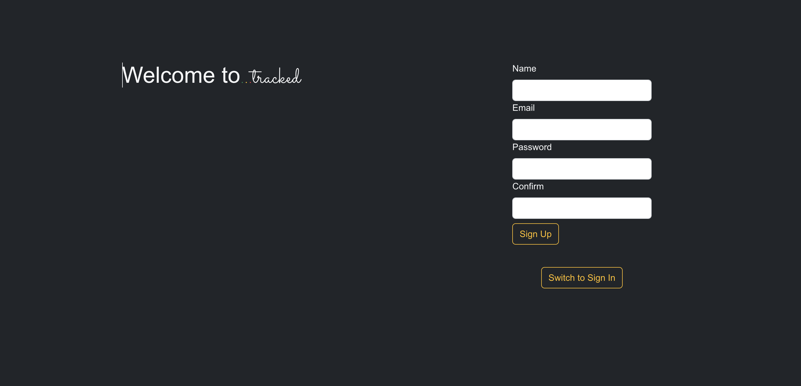

<!-- PROJECT LOGO -->
 

    

<!-- TABLE OF CONTENTS -->

  
Table of Contents

  <ol>
    <li><a href="#about-the-project">About The Project</a>
    <li><a href="#getting-started">Getting Started</a></li>
    <li><a href="#built-with">Built With</a></li>
    <li><a href="#icebox">Ice Box</a></li>
    <li><a href="#contact">Contact</a></li>
  </ol>

<!-- CONTENT -->

## About the Project

Introducing "...tracked" a Task Management App that caters to your organization and productivity needs. "...tracked" offers a user-friendly and intuitive interface for effortless task creation, management, and tracking. Whether you're a solo entrepreneur, a project manager, or part of a team, our app is designed to streamline your task management process.

## Getting Started

- After successfully setting up an account, you'll gain access to your personalized task management tools.
- Create a fresh task by selecting 'Add a New Task' from the dropdown menu and completing the required details.
- To view your current tasks, simply choose "My Current Tasks" from the dropdown menu.
- To modify a task or mark it as completed, simply click the 'Edit' button located alongside the task you wish to adjust.
- To remove a task, simply click the 'Delete' button located beside the task you wish to eliminate.

## Built With

- [MongoDB](https://www.mongodb.com/) 
- [Express.js](https://expressjs.com/)
- [React](https://reactjs.org/)
- [Node.js](https://nodejs.org/)
- [Mongoose](https://mongoosejs.com/)
- [Bootstrap](https://getbootstrap.com/)

## Icebox Items

1. Share tasks with other users
2. Categorize tasks

## Contact

 Reham Rantisi - rantisireham19@gmail.com

 

[:arrow_up: Back to top](#ReadMe)
